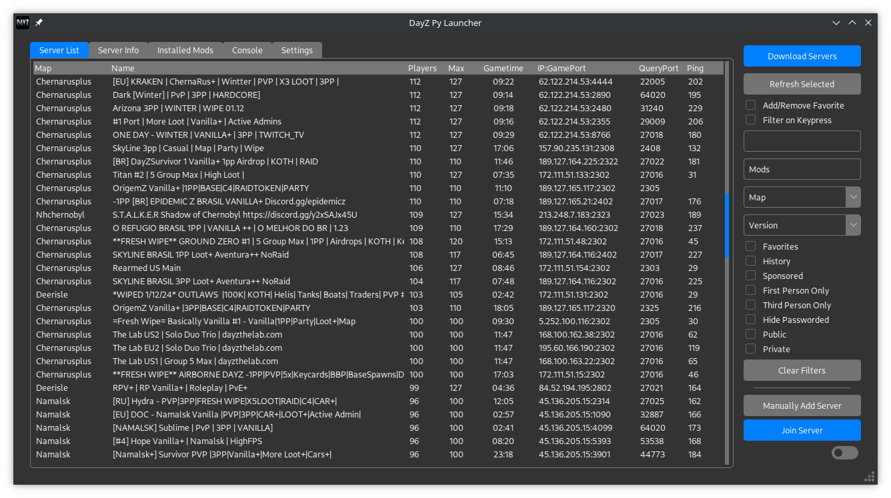
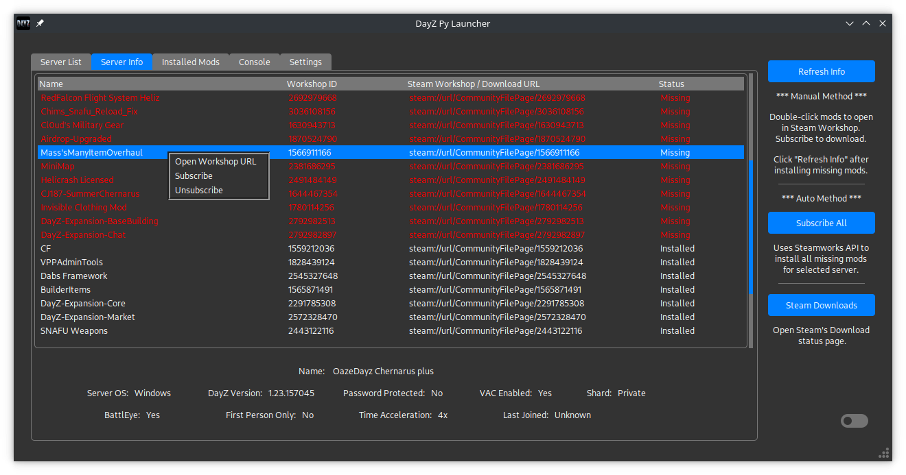
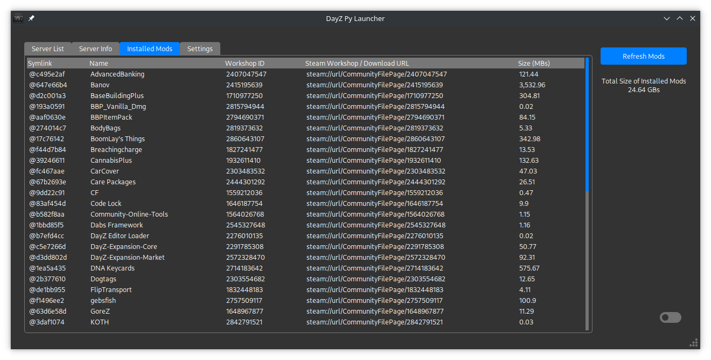
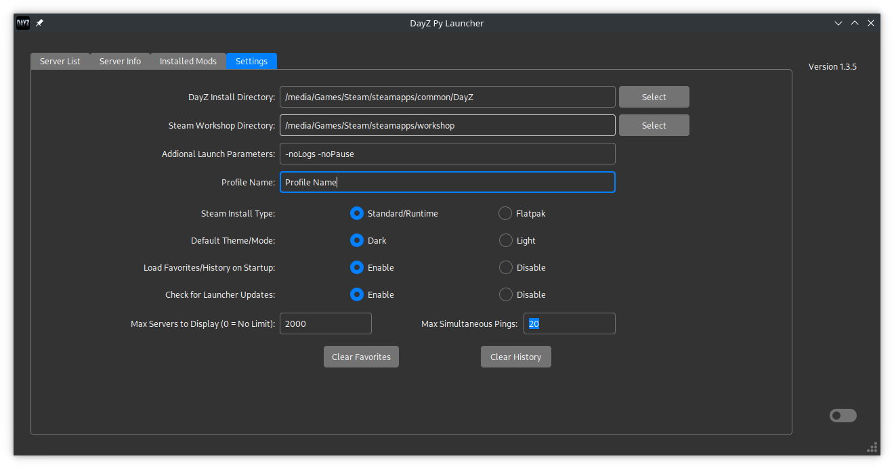

# DayZ Py Launcher

This is a **Linux** DayZ game launcher and server browser written in Python and uses Tkinter for the GUI. Currently a **WORK-IN-PROGRESS**. Would like to eventually make it work on Windows.

This uses DayZ Standalone Launcher's (DZSA) API to download the servers. After that, all queries go directly to the server using the a2s & dayzquery modules created by Yepoleb.

Tkinter theme used was created by rdbende (Azure-ttk-theme)

Have done no testing with Flatpak, only the normal Steam install on Manjaro. No auto-install for mods yet, but you can double-click on the missing mod under the 'Server Info' tab and it should load the Workshop in Steam for you to easily 'Subscribe'.

## Screenshots

## Current Features / How to use

* Upon opening the app, if no Steam or DayZ install directory is selected, it will try checking the default Steam install location for the 'libraryfolders.vdf' (similar to the process used in DZGUI). If not automatically detected, you will need to find and set them under settings. See above screenshot as an example. **See known bugs below about theme issues and selecting install directories.

* Click the 'Refresh All Servers' button to download and browser DayZ Standalone Launcher's API server list.

* Click the 'Refresh Selected' button to query the currently selected/highlighted server and pull the latest info (like Player count, Gametime, Ping, Mods)

* Select server to view info and installed mods under the 'Server Info' tab. Doble click on missing mods to open the Workshop URL and Subscribe. Once the mods are downloaded click the 'Refresh Info' button to update your installed mods.

* Set your DayZ 'Profile Name' under the Settings tab. If blank, you won't be able to join servers. 

* If all mods are installed you should be able to use the 'Join Server' button on 'Server List' tab.

* DayZ requires the vm.max_map_count to be increased or else it crashes upon loading. Upon Joining a server it will check if a user's vm.max_map_count is at least 1048576. If not, prompt for sudo password in order to execute the command to increase the vm.max_map_count.

* Once you join a server, it is added to your History. You can also click on a server and then hit the Checkbox 'Add/Remove Favorite'. If there's no blue check already, this will add to favorites. If it's checked, then it will remove it.

* By default, when you open DayZ Py Launcher, it will load your History and Favorites and queries the servers directly using a2s and dayzquery. So, if you don't need to find a new server, then you shouldn't even need to download the entire list from DZSA ('Refresh All Servers' button).

* Enabling 'Filter on Keypress' will cause the Server List to immeditately update on every letter/number/backspace entered into the filter entry box. If you don't limit the number of Servers to display under the settings, this can cause some lag due to the size of the DZSA server list. I have found that limiting it down to 2,000 - 2,500 will list most servers that actually have active players. But, if you happen to download the server list ('Refresh All Servers') while a server is rebooting (so 0 active players), then that server could possibly get cut out of the list.

* You can use the switch at the bottom right corner to toggle between light and dark mode. Or permanently set it under Settings.

* Any additional launch parameters you'd like to use can be set under the Settings tab. See screenshot above.

* Current default is to ping/query 20 servers at a time when loading the Server List. The lower you set it, the longer it will take to populate the Pings listed for each server. Turning it too high may cause you performance issues. If a server fails to repsond to a ping, it's ping will be listed at '999'.

## Not working / Known limitations

* No App update checks. Needs to be manually updated from here/Gitlab.
* Joining a server that is password protected
* Flatpak may not work since it's untested.
* Windows - Unable to join servers. The GUI stutters/hangs during loading and pinging servers after the 'Refresh All Servers'.

## Known Bugs

* For some reason the Theme is not being properly applied to tkinter's 'filedialog.askdirectory()'. When you first open it, the text for files/folders and the background are white until you click on one. A workaround I have found is to cancel/close the popup, use the toggle at the bottom right corner of the app to switch dark/light mode off and then back on. Then go back to select a directory.

## Installation

### Installer

Run this installer script in your terminal...

`curl -s "https://gitlab.com/tenpenny/dayz-py-launcher/-/raw/main/dayz_py_installer.sh" | bash`

Once the script is complete, you should be able to run DayZ Py Launcher from you're 'Start Menu'

Files are downloaded to $HOME/.local/share/dayz_py

### Manual

Download the compressed (zip, tar, etc) version from the top right. Extract. Open terminal and launch using...

`python dayz_py_launcher.py`

### Upgrades

Still working on implemting this into the launcher on startup. The setting is already there to Enable or Disable (Disabled by default), but the rest is incomplete. Until then, running the above install script or manually overwriting the dayz_py_launcher.py file will work.

## Special Thanks

DayZ Standalone Launcher (DZSA) for their API. [Website](https://dayzsalauncher.com/)

rdbende for the [theme](https://github.com/rdbende/Azure-ttk-theme/tree/gif-based/)

Yepoleb for the server query Python modules. [a2s](https://github.com/Yepoleb/python-a2s) & [dayzquery](https://github.com/Yepoleb/dayzquery)

The other Linux DayZ launchers...
* [DZGUI](https://github.com/aclist/dztui)
* [dayz-ctl](https://github.com/WoozyMasta/dayz-ctl)
* [DayZ Linux CLI Launcher](https://github.com/bastimeyer/dayz-linux-cli-launcher/)

Icon/Logo (unknown author) [Website](https://www.wallpaperflare.com/dayz-video-games-minimalism-monochrome-typography-artwork-wallpaper-pjmat)
