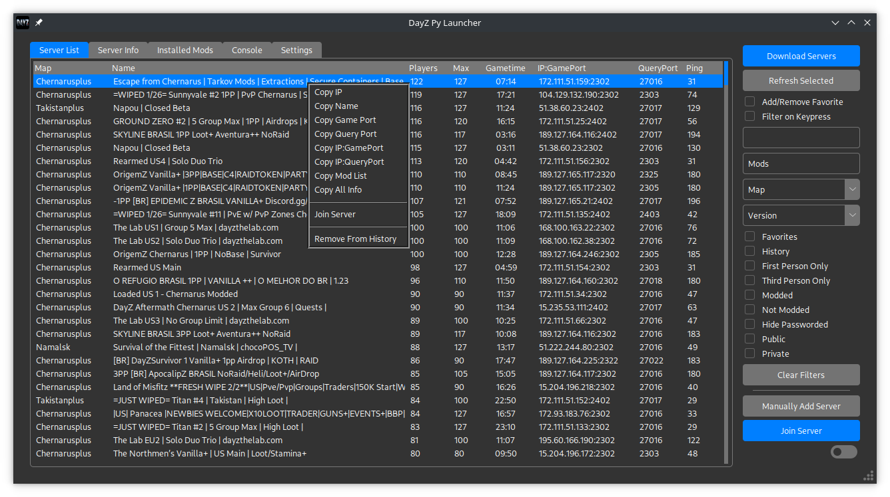
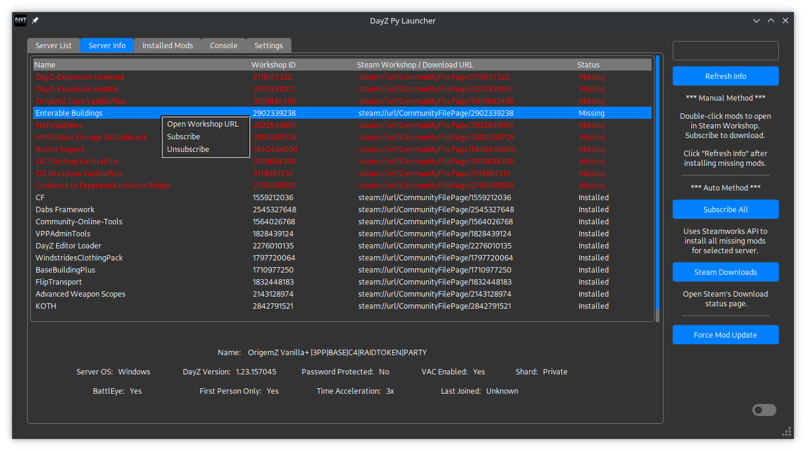
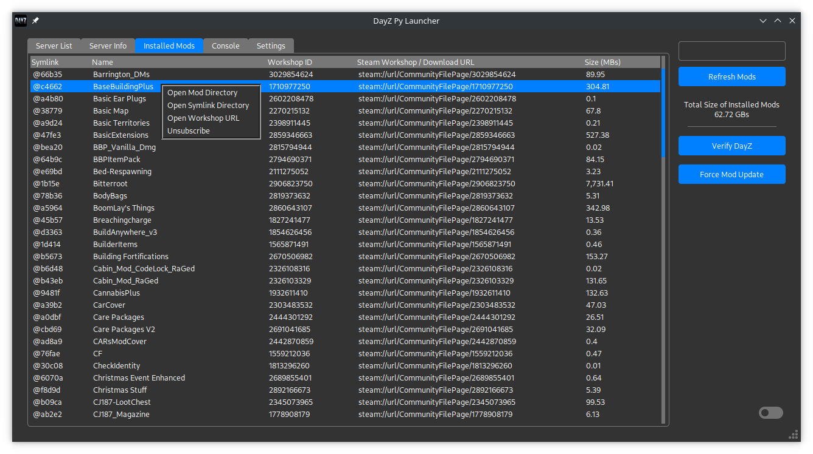
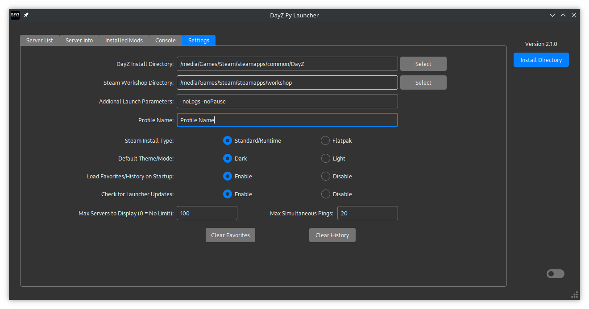

# DayZ Py Launcher

This is a **Linux** DayZ game launcher and server browser written in Python and uses Tkinter for the GUI. Currently a **WORK-IN-PROGRESS**. Also, works with Windows and should be able to work with non-NTFS drive (FAT32/exFAT).

This uses DayZ Standalone Launcher's (DZSAL) API to download the servers. After that, all queries go directly to the server using the a2s & dayzquery modules created by Yepoleb.

Tkinter theme used was created by rdbende (Azure-ttk-theme)

SteamworksPy from philippj & twstagg

Have done no testing with Flatpak, only the normal Steam install on Manjaro.

## Screenshots

## Current Features / How to use

* Upon opening the app, if no Steam or DayZ install directory is selected, it will try checking the default Steam install location for the 'libraryfolders.vdf'. If not automatically detected, you will need to find and set them under settings. See above screenshot as an example. **See known bugs below about theme issues and selecting install directories.

* Click the 'Download Servers' button to download and browse DayZ Standalone Launcher's API server list.

* Click the 'Refresh Selected' button to query the currently selected/highlighted server and pull the latest info (like Player count, Gametime, Ping, Mods)

* The 'Mods' search box allows you to enter a comma separated list. This will filter down the server list to only show servers that contain matching mods for all the mods you entered. Make sure to put a comma after each mod. 
(Example: winter chernarus, code locks, basebuildingplus)

* Select server to view info and installed mods under the 'Server Info' tab.

* Set your DayZ 'Profile Name' under the Settings tab. If blank, you won't be able to join servers. 

* If all mods are installed you should be able to use the 'Join Server' button on 'Server List' tab.

* DayZ requires the vm.max_map_count to be increased or else it crashes upon loading. Upon Joining a server it will check if a user's vm.max_map_count is at least 1048576. If not, prompt for sudo password in order to execute the command to increase the vm.max_map_count.

* Once you join a server, it is added to your History. You can also click on a server and then hit the Checkbox 'Add/Remove Favorite'. If there's no blue check already, this will add to favorites. If it's checked, then it will remove it. You can remove a server from your History using the Right Click menu.

* By default, when you open DayZ Py Launcher, it will load your History and Favorites and queries the servers directly using a2s and dayzquery. So, if you don't need to find a new server, then you shouldn't even need to download the entire list from DZSAL ('Download Servers' button).

* Enabling 'Filter on Keypress' will cause the Server List to immeditately update on every letter/number/backspace entered into the filter entry box. If you don't limit the number of Servers to display under the settings, this can cause some lag due to the size of the DZSAL server list. I have found that limiting it down to 2,000 - 2,500 will list most servers that actually have active players. But, if you happen to download the server list ('Download Servers') while a server is rebooting (so 0 active players), then that server could possibly get cut out of the list.

* Double clicking on a mod under "Installed Mods" will open the Steam Workshop page. Right Clicking will give you the option to open the mod directory in a file browser/explorer.

* You can use the switch at the bottom right corner to toggle between light and dark mode. Or permanently set it under Settings.

* Any additional launch parameters you'd like to use can be set under the Settings tab. See screenshot above.

* Current default is to ping/query 20 servers at a time when loading the Server List. The lower you set it, the longer it will take to populate the Pings listed for each server. Turning it too high may cause you performance issues. If a server fails to repsond to a ping, it's ping will be listed at '999'.

### Install Mods
* **Manual Method** - Double click on missing mods to open the Workshop URL and Subscribe. Once the mods are downloaded click the 'Refresh Info' button to update your installed mods.

* **Auto Method** - Right click on mods and "Subscribe". You can CTRL + Click to select multiple mods. Or use the "Subscribe All" to get all missing mods for the currently selected server.

* **Force Mod Update** - Haven't been able to test this on a lot of mods, but so far it's worked on all of them. If you run into an issue when you can't join a server because it has a newer version of the mod than you, select the mod from either the "Server Info" or "Installed Mods" tab and hit this button. You may need to hit the download button (down arrow next to DayZ) in Steam Downloads if it doesn't automatically start. This will depend on your Steam download settings and if you defer updates until you launch the game. Steamworks doesn't appear to let me track the download state of Updates, so instead, I tell Steam to open the Download page.

### Steamworks Notes
* When you Unsubscribe to a Workshop mod, it will not be uninstalled until DayZ and Steamworks are both not running. This is a Steam limitation.

* If you want to Download mods through DayZ Py Launcher and play DayZ at the same time, on Linux, you'll need to start DayZ first before Subscribing to the new mods in the Launcher. Else, when you go to start DayZ or Join a Server while the Launcher is Subscribing/Downloading mods, Steam will complain that DayZ is already running.

## Not working / Possible limitations

* Flatpak may not work since it's untested.

## Known Bugs

* For some reason the Theme is not being properly applied to tkinter's 'filedialog.askdirectory()'. When you first open it, the text for files/folders and the background are white until you click on one. A workaround I have found is to cancel/close the popup, use the toggle at the bottom right corner of the app to switch dark/light mode off and then back on. Then go back to select a directory. [Bug Info](https://github.com/rdbende/Sun-Valley-ttk-theme/issues/104)

* The GUI stutters/hangs during loading and especially on Windows when draging the app around and also when pinging servers after the 'Download Servers'. [Bug Info](https://github.com/rdbende/Azure-ttk-theme/issues/11)

* May not be able to Paste Copied server info (from the Right Click menu) into all applications. [Bug Info](https://github.com/python/cpython/issues/104613)

## Launcher Installation

* Depending on your Python installation and/or Linux Distro, you may need to install additional packages like Tkinter. On Manjaro and others based on Arch, this can be installed by running the following from the terminal...

    `sudo pacman -S tk`

### Installer

### Linux...

Run this installer script in your terminal...

`curl -s "https://gitlab.com/tenpenny/dayz-py-launcher/-/raw/main/dayz_py_installer.sh" | bash`

* Files are downloaded to $HOME/.local/share/dayz_py

* Once the script is complete, you should be able to run DayZ Py Launcher from your 'Start Menu'

### Windows...

* If you don't have Python installed on Windows, you can get it from [here](https://www.python.org/downloads/release/python-3116/).

* Make sure you have added Python to your PATH (this can be set during the Python Installation) and installed the Python "Requests" & "pywin32" modules.

    `pip install requests`

    `pip install pywin32`

Run this installer script in PowerShell...

`iwr -useb https://gitlab.com/tenpenny/dayz-py-launcher/-/raw/main/dayz_py_installer.ps1 | iex`

* Files are installed to %AppData%/dayz_py

* Once the script is complete, you should be able to run DayZ Py Launcher from your 'Start Menu'

### Manual / Portable

Download the compressed (zip, tar, etc) version from the top right. Extract. Open terminal and launch using...

`python dayz_py_launcher.py`

### Upgrades

If an update is available, you should be prompted shortly after the app starts. If you choose to update, restart the app once completed. Can disable update checks under the Settings tab.

You can also run the same script in the Installer section above.

## Special Thanks

DayZ Standalone Launcher (DZSAL) for their API. [Website](https://dayzsalauncher.com/)

rdbende for the [Theme](https://github.com/rdbende/Azure-ttk-theme/tree/gif-based/) |  [License](https://github.com/rdbende/Azure-ttk-theme/blob/gif-based/LICENSE)

Yepoleb for the server query Python modules. [a2s](https://github.com/Yepoleb/python-a2s) | [License](https://github.com/Yepoleb/python-a2s/blob/master/LICENSE) & [dayzquery](https://github.com/Yepoleb/dayzquery) | [License](https://github.com/Yepoleb/dayzquery/blob/master/LICENSE)

The other Linux DayZ launchers...
* [DZGUI](https://github.com/aclist/dztui)
* [dayz-ctl](https://github.com/WoozyMasta/dayz-ctl)
* [DayZ Linux CLI Launcher](https://github.com/bastimeyer/dayz-linux-cli-launcher/)

Kuch for the Logo

philippj and twstagg for SteamworksPy. [philippj](https://github.com/philippj/SteamworksPy) | [License](https://github.com/philippj/SteamworksPy/blob/master/LICENSE) & [twstagg](https://github.com/twstagg/SteamworksPy) | [License](https://github.com/twstagg/SteamworksPy/blob/master/LICENSE)

[Steamworks](https://partner.steamgames.com/)
